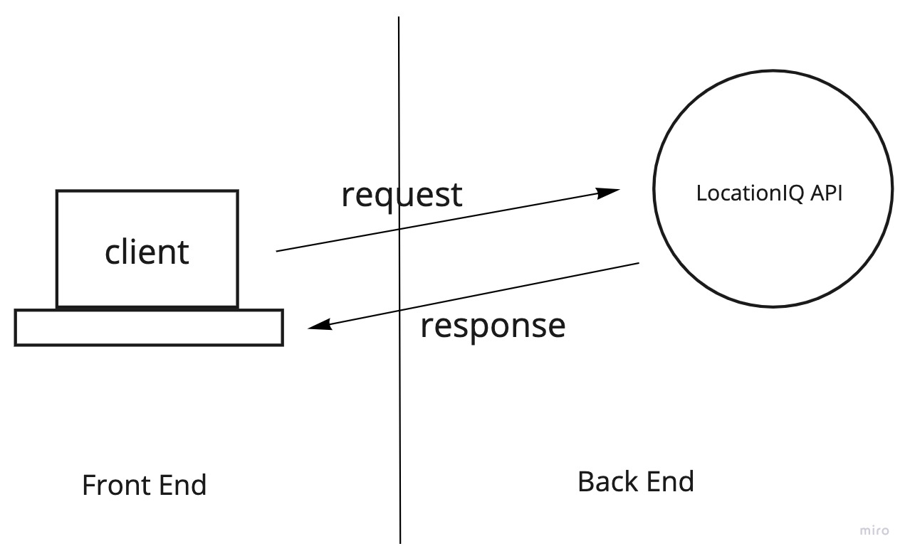
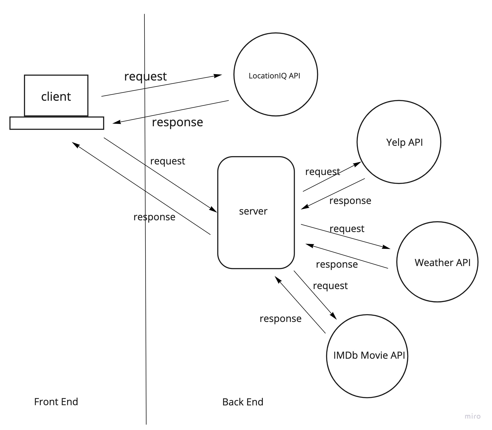

# city-explorer-api

Name of feature: Set up server

Estimate of time needed to complete: 4 hours

Start time: 3:00PM

Finish time: 11:00PM

Actual time needed to complete: 8 hours

Name of feature: Movies API

Estimate of time needed to complete: 4 hours

Start time: 3:00PM

Finish time: 9:00PM

Actual time needed to complete: 6 hours

Name of feature: Create modules for weather and movies

Estimate of time needed to complete: 2 hours

Start time: 2:00PM

Finish time: 4:00PM

Actual time needed to complete: 2 hours
